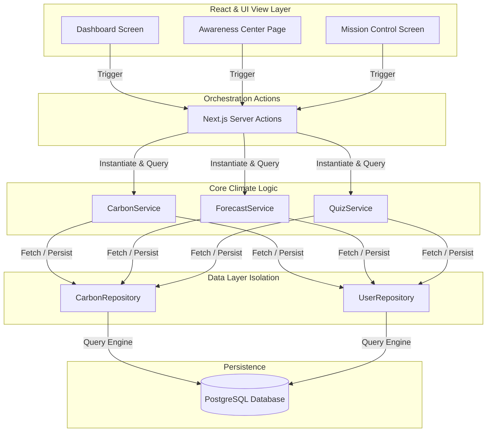

# CarbonMind AI — System Architecture Specification

## 🏗️ Architectural Overview

CarbonMind AI implements a strict **Domain-Driven Architecture** combined with a **Service Layer Pattern** and **Repository Pattern** to separate raw storage interactions, business logic orchestration, and frontend React views.

---

## 📂 Modular Structure

*   **`src/app/`**: Next.js 16 file-system router page layouts and actions configurations.
*   **`src/actions/`**: Server Actions handling API entry points and user validation checks.
*   **`src/services/`**: Climate AI mathematical projection modeling, quiz grading, and carbon scoring metrics.
*   **`src/repositories/`**: Clean DB interface methods wrapping all Prisma query structures.
*   **`src/types/`**: Common types, enums, and interfaces for model typing safety.
